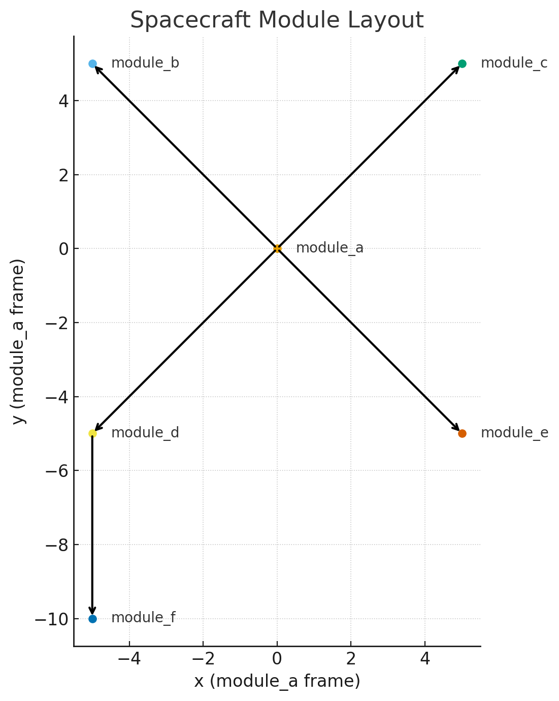

# Spacecraft-Inertia-Tensor-Tree

Compute the moment of inertia (MOI) for a modular spacecraft assembled as a tree of rigid modules.
Each module has its own mass points; the tree wires modules together with a relative transform (quaternion + offset).
A depth-first (post-order) pass accumulates children first, then parents, up to the root.

## Station Used in Code:

- Total modules: 6 (a root; children b,c,d,e; f is child of d)
- Mass per module: 4 points × 500 kg = 2000 kg
- Total mass: 12,000 kg

## Legend:

- Labels on edges are parent_offset [dx,dy] from child COM to parent COM.
- “roll θ°” means the quaternion given is a rotation about x by θ (per your data).
- All modules have identical internal point layout at (±1, ±1, 0).
